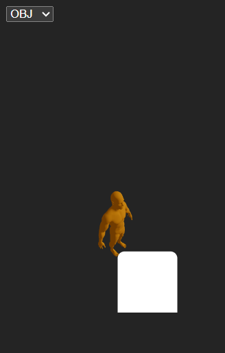

# 🧪 Workshop - 3D Format Conversion and Visualization

## 📅 Date
`2025-04-30`

---

## 🎯 Objective

This workshop explores two different approaches to 3D model visualization and conversion: one using a web-based viewer with Three.js (React Three Fiber), and the other using Python with Trimesh and Open3D. The goal is to load, render, analyze, and convert 3D models across various formats such as OBJ, GLB, and STL.

---

## 🧠 Concepts Covered

- [x] Loading and visualizing `.obj`, `.glb`, and `.stl` models
- [x] Mesh structure analysis (vertices, faces, normals)
- [x] Format conversion using Trimesh
- [x] Rendering interactive scenes in Three.js with OrbitControls
- [x] Python visualization with Open3D
- [x] Project structuring and file organization

---

## 🔧 Tools and Environments

- **Web**: React Three Fiber, Drei, gltfjsx, Vite
- **Python**: Trimesh, Open3D, NumPy
- **Environment**: Google Colab or local Python, VSCode for React

---

## 📁 Project Structure

```bash
2025-04-30_taller_conversion_formatos_3d/
├── python/
│   ├── models/
│   │   └── FinalBaseMesh.obj
│   └── FinalBaseMesh_Conversion_Analysis.ipynb
├── threejs/
│   └── model-3d/
│       ├── public/
│       │   └── resultado/
│       │       └── orbitcontrols.gif
│       ├── src/
│       ├── .gitignore
│       ├── eslint.config.js
│       ├── index.html
│       ├── package.json
│       ├── package-lock.json
│       ├── README.md
│       ├── vite.config.js
└── README.md
```

---

## 🧪 Implementation Summary

### 🔷 Three.js (Frontend)

- A `.gltf` model was imported and converted to a `.jsx` component using `gltfjsx`.
- The component was rendered inside a `<Canvas>` with ambient lighting and interactive OrbitControls.
- The model was scaled, rotated, and positioned for better visual alignment.
- CSS adjustments ensured the canvas occupied full screen without overflow.

### 🔷 Python (Backend)

- The `.glb` model was loaded with Trimesh and converted to a unified mesh.
- Geometry properties (vertices, faces, edges) were computed and printed.
- The mesh was visualized with Open3D after computing vertex normals.
- Errors with relative paths and empty textures were resolved by forcing mesh extraction and skipping color loads.

---

## 📊 Visual Results

### Three.js


### Python


---

## 💡 Prompts Used

```text
"How to position and scale a GLTF model in React Three Fiber"
"How to convert a trimesh scene to a single mesh"
"Why doesn't Open3D show colors from a GLB file"
"How to print mesh structure info from trimesh"
```

---

## 🧩 Key Challenges

- Web rendering required scale and camera adjustments.
- CSS styling required root-level full-size configuration.
- Open3D ignored texture colors—fallback to mesh rendering.
- Trimesh scenes sometimes needed manual concatenation of meshes.

---

## 💬 Final Reflection

This workshop allowed a practical understanding of both artistic rendering in web environments and technical mesh analysis using Python. The challenge of handling different formats, extracting geometric properties, and organizing file systems reinforces good practices in 3D development pipelines.

---

## ✅ Submission Checklist

- [x] 3D visualization in browser using React Three Fiber
- [x] 3D visualization and analysis in Python
- [x] Format conversion from `.obj` to `.stl` and `.glb`
- [x] Code in clean project structure
- [x] Screenshots or GIFs included
- [x] This `README.md` completed
