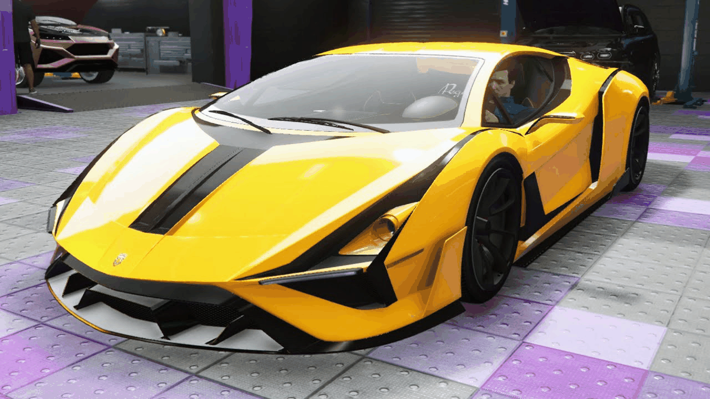

# Taller - De Píxeles a Coordenadas: Explorando la Imagen como Matriz

Este taller consistió en analizar y transformar una imagen real (`ignus.jpg`) entendiendo su estructura como matriz de píxeles. A través de slicing, separación de canales, conversiones de color, ajuste de brillo/contraste y visualización de histogramas, se exploraron las principales operaciones de análisis en imágenes digitales.

---

## Actividades realizadas

1. **Carga de la imagen `ignus.jpg`** y análisis de su forma matricial.
2. **Extracción y modificación de regiones** de la imagen mediante slicing.
3. **Separación de canales RGB** (Rojo, Verde, Azul).
4. **Conversión a espacio HSV** y separación de canales H, S y V.
5. **Modificación de brillo y contraste manualmente** con operaciones matriciales.
6. **Aplicación de brillo y contraste usando OpenCV** con `cv2.convertScaleAbs()`.
7. **Cálculo de histogramas de intensidad** con:
   - `matplotlib.pyplot.hist()`
   - `cv2.calcHist()`
8. **Creación de un GIF animado** para visualizar los resultados visuales (sin incluir histogramas).

---

## Resultados

- `01_original.jpg`: imagen base.
- `02_slicing.jpg`: se colorea una región con rojo.
- `03_R.jpg`, `04_G.jpg`, `05_B.jpg`: canales RGB separados.
- `06_H.jpg`, `07_S.jpg`, `08_V.jpg`: canales HSV separados.
- `09_brillo_manual.jpg`, `10_contraste_manual.jpg`: transformaciones con NumPy.
- `11_brillo_cv.jpg`, `12_contraste_cv.jpg`: transformaciones con OpenCV.
- `hist_*.png`: histogramas por canal (matplotlib).
- `hist_cv2_*.png`: histogramas por canal (cv2.calcHist).
- `transformaciones.gif`: animación resumen del procesamiento.

### Vista previa del GIF:



---

## Código relevante

```python
# Slicing sobre imagen RGB
img_modificada[0:100, 0:100] = (255, 0, 0)
```

```python
# Conversión a HSV
hsv = cv2.cvtColor(img_rgb, cv2.COLOR_RGB2HSV)
H, S, V = cv2.split(hsv)
```

```python
# Brillo y contraste manual
brillo = np.clip(img_rgb + 50, 0, 255).astype(np.uint8)
contraste = np.clip(1.3 * img_rgb - 30, 0, 255).astype(np.uint8)
```

```python
# Brillo y contraste con OpenCV
img_brightness = cv2.convertScaleAbs(img_rgb, alpha=1, beta=50)
img_contrast = cv2.convertScaleAbs(img_rgb, alpha=1.3, beta=0)
```

```python
# Histograma con cv2.calcHist()
hist = cv2.calcHist([canal], [0], None, [256], [0, 256])
```

---

## Comentarios personales

- Este taller me permitió visualizar la imagen como una matriz manipulable.
- Ajustar brillo y contraste manualmente fortaleció mi comprensión de las intensidades.
- Comparar matplotlib y OpenCV para histogramas evidenció distintos niveles de control.

---

## Autor

Juan Pablo Gómez Rangel
