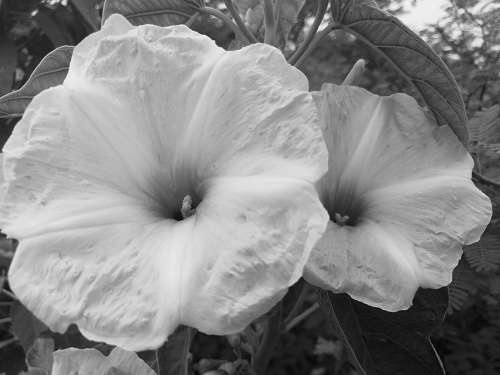

# Taller - Segmentando el Mundo: Binarización y Reconocimiento de Formas

Este taller consistió en aplicar técnicas de procesamiento de imágenes para segmentar formas dentro de una imagen natural (`flor.jpg`), detectar contornos y calcular propiedades geométricas relevantes como centroides, bounding boxes, área y perímetro.

---

## Actividades realizadas

1. **Conversión a escala de grises** de la imagen `flor.jpg`.
2. **Binarización fija** con `cv2.threshold`.
3. **Binarización adaptativa** con `cv2.adaptiveThreshold`.
4. **Detección de contornos** usando `cv2.findContours`.
5. **Dibujo de cada forma**:
   - Contornos (verde)
   - Bounding boxes (azul)
   - Centroides y coordenadas (rojo)
6. **Cálculo de métricas globales**:
   - Número total de formas detectadas
   - Área promedio
   - Perímetro promedio
7. **Creación de un GIF animado** que muestra el proceso de segmentación.

---

## Métricas obtenidas

- **Número de formas**: 41  
- **Área promedio**: 545.04 px²  
- **Perímetro promedio**: 356.60 px

---

## Resultados visuales

### GIF resumen del proceso:



---

## Código relevante

```python
# Binarización fija
_, thresh_fijo = cv2.threshold(gray, 127, 255, cv2.THRESH_BINARY_INV)
```

```python
# Binarización adaptativa
thresh_adapt = cv2.adaptiveThreshold(gray, 255, cv2.ADAPTIVE_THRESH_MEAN_C,
                                     cv2.THRESH_BINARY_INV, 11, 5)
```

```python
# Detección de contornos
contornos, _ = cv2.findContours(thresh_adapt, cv2.RETR_EXTERNAL, cv2.CHAIN_APPROX_SIMPLE)
```

```python
# Bounding box y centroide
x, y, w, h = cv2.boundingRect(cnt)
M = cv2.moments(cnt)
cx = int(M["m10"] / M["m00"])
cy = int(M["m01"] / M["m00"])
```

```python
# Métricas globales
area_prom = np.mean(areas)
perim_prom = np.mean(perimetros)
```

---

## Autor

Juan Pablo Gómez Rangel
