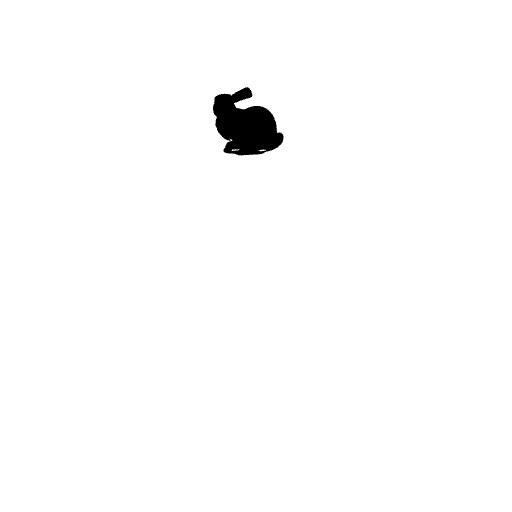
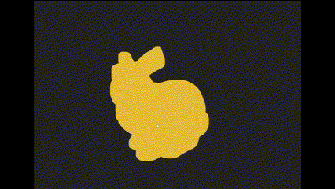

# 🐰 Análisis y Visualización del Modelo 3D: Stanford Bunny

Este proyecto consta de dos partes principales:

---

## Parte 1 – Análisis en Python

Se utiliza la biblioteca `trimesh` para analizar el modelo 3D `bunny.obj` ubicado en la raíz del proyecto.

### Herramientas:
- `trimesh`
- `pyrender`
- `imageio`
- `numpy`

### Acciones realizadas:
- Carga del modelo desde `../bunny.obj`
- Cálculo e impresión de:
  - Número de vértices
  - Número de caras
  - Número estimado de aristas
- Renderizado de imagen estática (`vista_bunny.png`)
- Generación de GIF giratorio (`bunny_rotando.gif`)

### Vista del modelo en rotación:



---

## Parte 2 – Visualización Web con Three.js y React

Se usa `React Three Fiber` (binding de React para Three.js) para visualizar el modelo 3D con controles interactivos.

### Herramientas:
- `three`
- `@react-three/fiber`
- `@react-three/drei`
- `OBJLoader`

### Características:
- Visualización interactiva con `OrbitControls`
- Modelo centrado en escena para rotación fluida
- Aristas resaltadas en color **rojo** (`Edges`)
- Vértices representados con puntos color **naranja**

### Captura de la visualización web:



---

## 📁 Estructura recomendada del proyecto

```
/bunny.obj
/python/
    analisis_bunny.py
    resultados/
        vista_bunny.png
        bunny_rotando.gif
/threejs/
    vite-project/
        public/
            bunny.obj
        src/
            ModelViewer.jsx
            App.jsx
        vista_interactiva.gif
```

---

## 👤 Autor

Juan Pablo Gómez Rangel