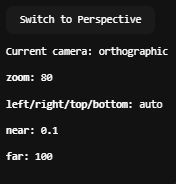
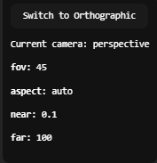

# Taller – Proyecciones 3D: Cómo ve una Cámara Virtual

Este proyecto explora cómo se visualiza una escena tridimensional desde una **cámara virtual**, comparando dos modos principales de proyección: **perspectiva** y **ortográfica**, implementados con Three.js y React Three Fiber.

---

## Objetivo

Visualizar los efectos que tiene cambiar entre diferentes modos de proyección de cámara sobre una escena 3D. Comprender cómo los parámetros como el campo de visión (`fov`), `zoom`, y las matrices de proyección afectan la representación final de la escena.

---

## Conceptos explicados

### Proyección en Perspectiva

- Simula cómo vemos en el mundo real: los objetos más lejanos se ven más pequeños.
- Utiliza un parámetro `fov` (field of view) para definir cuánto "abarca" la cámara.
- Es adecuada para escenas donde la profundidad es importante para la percepción visual.

### Proyección Ortográfica

- No aplica distorsión por distancia: los objetos mantienen su tamaño sin importar qué tan lejos estén.
- Usa una proyección paralela, más útil en diseño técnico, juegos 2D o vistas de mapas.
- El tamaño de la vista depende del parámetro `zoom`.

---

## Comparación Visual

### Comparación de cámaras en acción


Este GIF muestra cómo cambia la percepción de la escena al alternar entre cámara perspectiva y ortográfica.

### Parámetros mostrados en pantalla

| Perspectiva | Ortográfica |
|-------------|-------------|
|  |  |

---

## Código relevante

El proyecto está construido con React y Three.js usando React Three Fiber.

- Cambio dinámico entre `<PerspectiveCamera>` y `<OrthographicCamera>`.
- Panel de información textual con los parámetros de cámara.
- `OrbitControls` para manipular la cámara en tiempo real.

Código clave:

```jsx
<Canvas>
  <ambientLight />
  <pointLight position={[10, 10, 10]} />
  <CameraSwitcher mode={mode} />
  <Objects />
  <OrbitControls />
</Canvas>
```

## Reflexión final

Una cámara virtual en gráficos computacionales no "ve" como lo haría un ojo humano; en su lugar, transforma puntos tridimensionales del mundo a coordenadas bidimensionales de pantalla mediante una **matriz de proyección 4x4**.

Este taller permitió experimentar directamente con dos formas distintas de proyectar la escena:

- **La cámara en perspectiva**, que introduce distorsión por profundidad, transforma los objetos según su distancia a la cámara, simulando cómo percibimos el mundo real.
- **La cámara ortográfica**, en cambio, elimina esa distorsión: todos los objetos, estén cerca o lejos, conservan su tamaño relativo, útil para ciertas tareas técnicas o artísticas.

Al alternar entre ambas, se hizo evidente cómo **la proyección afecta directamente la percepción espacial, proporciones y profundidad de una escena**.

Esta comprensión se refuerza al observar cómo parámetros como `fov`, `aspect`, `zoom`, y los planos `near/far` modifican la matriz, y por tanto, la imagen final. Esto nos demuestra que ver en 3D desde un computador **no es simplemente renderizar objetos, sino transformar matemáticamente el espacio para poder ser proyectado con lógica y precisión visual**.
