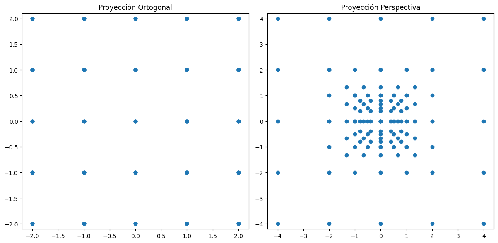
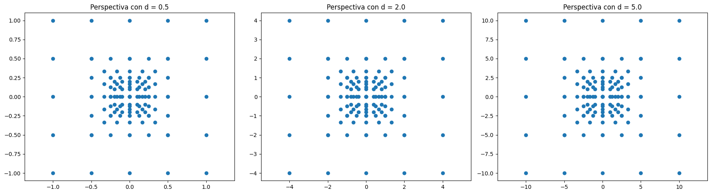
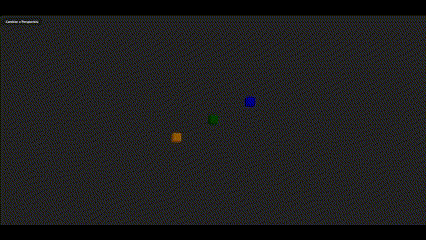
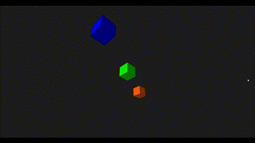

# Taller: Espacios Proyectivos y Matrices de Proyección

Este taller explora los conceptos de proyección en gráficos computacionales mediante la implementación en Python, Three.js (React Three Fiber) y Processing.

---

## Tipos de Proyección

### Proyección Ortográfica
- Los objetos no cambian de tamaño con la profundidad.
- Se usa para planos técnicos o CAD.

### Proyección Perspectiva
- Los objetos se ven más pequeños si están más lejos.
- Simula cómo percibimos el mundo con nuestros ojos.

---

## Python

En esta sección se generaron puntos en 3D, se proyectaron mediante matrices ortogonales y de perspectiva, y se visualizó la diferencia.

```python
def proyectar_perspectiva(puntos, d=1.0):
    P = np.array([
        [1, 0, 0, 0],
        [0, 1, 0, 0],
        [0, 0, 1, 0],
        [0, 0, 1/d, 0]
    ])
    puntos_hom = np.vstack((puntos, np.ones((1, puntos.shape[1]))))
    proy = P @ puntos_hom
    proy /= proy[-1, :]
    return proy[:2]
```

| Ortográfica | Perspectiva |
|-------------|-------------|
|  |  |

---

## Three.js (React Three Fiber)

Se implementó una escena con cubos a diferentes profundidades.  
Se usó `OrbitControls` y un botón para alternar entre cámara ortográfica y perspectiva.

```jsx
<button onClick={() => setUseOrtho(!useOrtho)}>
  Cambiar a {useOrtho ? 'Perspectiva' : 'Ortográfica'}
</button>
```

**Demostración:**



---

## Processing 3D

Se creó una escena con cubos en el eje Z.  
Se alternó entre `ortho()` y `perspective()` presionando la tecla `P`.

```java
if (ortografica) {
  ortho(-width/2, width/2, -height/2, height/2, 0.1, 1000);
} else {
  perspective(PI/3.0, float(width)/float(height), 0.1, 1000);
}
```

**Demostración:**



---

## Conclusión

Cada entorno permitió observar y comparar cómo la proyección afecta la representación visual de los objetos.  
Las diferencias entre ortográfica y perspectiva son cruciales para gráficos 3D realistas y técnicos.
