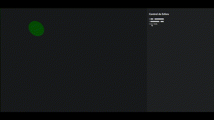

# Taller WebSockets e Interacción Visual

## Objetivo

Implementar una visualización en tiempo real usando WebSockets. Se desarrolló:
- Un servidor en Python que envía datos por WebSocket.
- Un cliente con React Three Fiber que visualiza una esfera en movimiento.
- Un panel de control embebido para modificar posición y color en vivo.

---

## Tecnologías Usadas

- Python 3 con `websockets` y `asyncio`
- React con Vite
- React Three Fiber y Drei
- WebSocket nativo en navegador

---

## Estructura del Proyecto

```
2025-04-XX_taller_websockets_interaccion_visual/
├── python/
│   └── server.py
├── threejs/
│   ├── src/
│   │   └── App.jsx
│   └── ...
├── README.md
└── demo.gif
```

---

## Cómo Ejecutar

### Backend (Python)

1. Instalar dependencias:
   ```bash
   pip install websockets
   ```

2. Ejecutar servidor:
   ```bash
   cd python
   python server.py
   ```

---

### Frontend (Three.js con React)

1. Instalar dependencias:
   ```bash
   cd threejs
   npm install
   ```

2. Ejecutar:
   ```bash
   npm run dev
   ```

---

## Interacción

- Panel de control con sliders y selectores que controlan:
  - Posición X e Y de la esfera
  - Color: rojo, verde o azul
- La esfera se actualiza en tiempo real según los datos enviados por WebSocket.

---

## Evidencia



---

## Evaluación

- WebSocket funcional entre cliente y servidor
- Visualización en tiempo real
- Interfaz integrada con panel de control
- Estructura clara y código comentado
- Evidencia de funcionamiento

---

## Autor

[Tu nombre aquí]