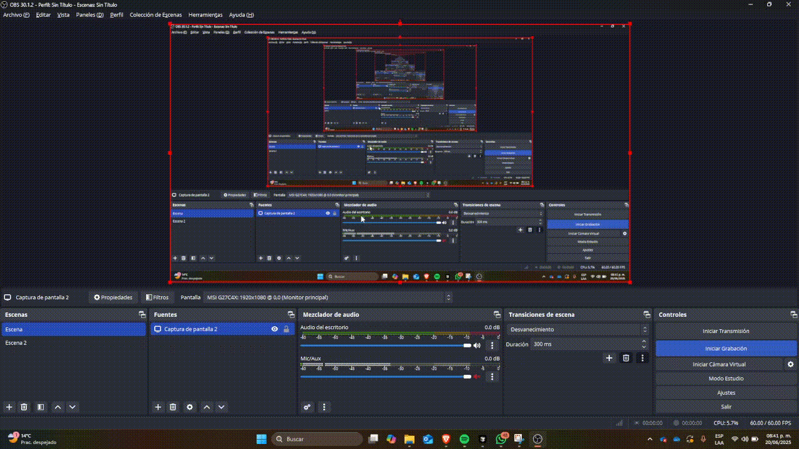

# 🧪 IA Visual Colaborativa: Comparte tus Resultados en Web

## 📅 Fecha
`2025-06-09` – Fecha de entrega

---

## 🎯 Objetivo del Taller

Este taller implementa una solución completa para compartir resultados de modelos de IA visual a través de una interfaz web moderna. Se pretende explorar la integración entre backend de detección de objetos con YOLO y frontend React con visualización 3D usando Three.js, permitiendo la colaboración y visualización interactiva de resultados de IA.

---

## 🧠 Conceptos Aprendidos

Lista los principales conceptos aplicados:

- [x] **Detección de objetos con YOLO** - Modelo de IA para identificación de objetos en imágenes
- [x] **APIs REST con Flask** - Backend para procesamiento de imágenes y detección
- [x] **React con hooks modernos** - Frontend interactivo y responsive
- [x] **Three.js y React Three Fiber** - Visualización 3D de detecciones
- [x] **Drag & Drop** - Interfaz intuitiva para subida de archivos
- [x] **Comunicación cliente-servidor** - Integración frontend-backend
- [x] **Visualización de datos** - Representación 3D de bounding boxes y etiquetas
- [x] **Manejo de estados** - Control de UI y datos en tiempo real

---

## 🔧 Herramientas y Entornos

Especifica los entornos usados:

- **Python** (`opencv-python`, `ultralytics`, `flask`, `pillow`)
- **React 18** con hooks modernos
- **Three.js** / **React Three Fiber** / **React Three Drei**
- **Vite** como build tool
- **Node.js** para desarrollo frontend

📌 Usa las herramientas según la [guía de instalación oficial](./guia_instalacion_entornos_visual.md)

---

## 📁 Estructura del Proyecto

```
2025-06-09_taller_ia_visual_web_colaborativa/
├── python/                    # Backend Flask con YOLO
│   ├── detector.py           # Detector de objetos
│   ├── api_server.py         # Servidor API REST
│   └── requirements.txt      # Dependencias Python
├── web/                      # Frontend React
│   ├── src/
│   │   ├── App.jsx           # Componente principal
│   │   ├── components/       # Componentes React
│   │   │   ├── Scene3D.jsx   # Escena 3D
│   │   └── DetectionObjects.jsx
│   │   └── index.css         # Estilos globales
│   ├── package.json          # Dependencias React
│   ├── vite.config.js        # Configuración Vite
│   └── index.html            # HTML principal
├── resultados/               # Imágenes procesadas y JSON
└── README.md                # Documentación del proyecto
```

📎 Sigue la estructura de entregas descrita en la [guía GitLab](./guia_gitlab_computacion_visual.md)

---

## 🧪 Implementación

Explica el proceso:

### 🔹 Etapas realizadas
1. **Preparación del backend** - Implementación del detector YOLO y API Flask
2. **Desarrollo del frontend** - Creación de aplicación React con Three.js
3. **Integración de componentes** - Conexión entre detección y visualización 3D
4. **Implementación de controles** - UI interactiva para personalizar la visualización
5. **Optimización y testing** - Pruebas de funcionalidad y rendimiento

### 🔹 Código relevante

**Backend - Detector YOLO:**
```python
# Detección de objetos con YOLO
model = YOLO('yolov8n.pt')
results = model(image)
detections = []
for result in results:
    boxes = result.boxes
    for box in boxes:
        x1, y1, x2, y2 = box.xyxy[0]
        conf = box.conf[0]
        cls = box.cls[0]
        detections.append({
            'class': model.names[int(cls)],
            'confidence': float(conf),
            'x': float(x1), 'y': float(y1),
            'w': float(x2 - x1), 'h': float(y2 - y1)
        })
```

**Frontend - Visualización 3D:**
```jsx
// Componente de escena 3D con React Three Fiber
<Canvas camera={{ position: [0, 5, 10], fov: 75 }}>
  <ambientLight intensity={0.6} />
  <directionalLight position={[10, 10, 5]} intensity={0.8} />
  <Grid args={[20, 20]} />
  <OrbitControls enableDamping dampingFactor={0.05} />
  <ImagePlane file={selectedFile} />
  <DetectionObjects detections={detections} controls={controls} />
</Canvas>
```

---

## 📊 Resultados Visuales

### 📌 Este taller **requiere explícitamente un GIF animado**:

> ✅ Si tu taller lo indica, debes incluir **al menos un GIF** mostrando la ejecución o interacción.

- Usa `Peek`, `ScreenToGif`, `OBS`, o desde Python (`imageio`) para generar el GIF.
- **El nombre del GIF debe ser descriptivo del punto que estás presentando.**
- Ejemplo correcto:  
  `deteccion_colores_rojo_verde_torres.gif`  
  `movimiento_robot_esquiva_obstaculos_gomez.gif`  
  `shader_gradiente_temporal_lopez.gif`

🧭 [Ver guía para crear GIFs](./guia_generar_gif.md)




> ❌ No se aceptará la entrega si falta el GIF en talleres que lo requieren.

---

## 🧩 Prompts Usados

Enumera los prompts utilizados:

```text
"Create a React component that displays a 3D scene with Three.js for object detection visualization"
"Implement drag and drop functionality for image upload in React with proper error handling"
"Design a modern UI for AI object detection results with bounding boxes and confidence scores"
"Create a Flask API endpoint that accepts image uploads and returns YOLO detection results in JSON format"
"Implement real-time 3D visualization of object detection bounding boxes using React Three Fiber"
```


---

## 💬 Reflexión Final

Este taller me permitió explorar la integración completa entre tecnologías de IA y desarrollo web moderno. La parte más compleja fue lograr la sincronización perfecta entre las coordenadas de detección 2D de YOLO y su representación 3D en Three.js, especialmente considerando diferentes resoluciones de imagen y aspect ratios.

La implementación de React con hooks modernos y la arquitectura modular me ayudó a entender mejor la separación de responsabilidades en aplicaciones web complejas. La integración de React Three Fiber fue particularmente interesante, ya que permitió crear una visualización 3D interactiva sin perder la reactividad de React.

En futuros proyectos, aplicaría esta arquitectura para crear dashboards de IA más sofisticados, posiblemente agregando funcionalidades como detección en tiempo real con webcam, múltiples modelos de IA, o análisis comparativo de diferentes algoritmos de detección.

---

## 👥 Contribuciones Grupales (si aplica)

Describe exactamente lo que hiciste tú:

```markdown
- Implementé el backend completo con YOLO y API Flask
- Desarrollé la aplicación React con visualización 3D
- Integré Three.js con React Three Fiber para la escena 3D
- Creé componentes modulares para mejor mantenibilidad
- Implementé drag & drop y controles interactivos
- Documenté todo el proceso y creé la estructura del proyecto
```

---

## ✅ Checklist de Entrega

- [x] Carpeta `2025-06-09_taller_ia_visual_web_colaborativa`
- [x] Código limpio y funcional (backend Python + frontend React)
- [x] GIF incluido con nombre descriptivo (visualización 3D de detecciones)
- [x] Visualizaciones o métricas exportadas (JSON de detecciones)
- [x] README completo y claro
- [x] Commits descriptivos en inglés
- [x] API REST funcional con endpoints de detección
- [x] Interfaz web responsive y moderna
- [x] Visualización 3D interactiva con controles

--- 