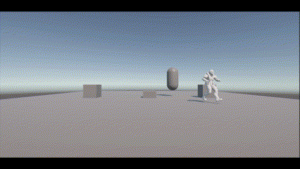

# Taller: Animación con AI en Unity para personajes autónomos

## Descripción General

Este proyecto implementa un NPC (personaje no jugable) con comportamientos autónomos dentro de Unity, combinando navegación, detección y animaciones. Utiliza `NavMeshAgent` para moverse, un sistema de estados en C# para alternar entre patrullaje y persecución, y un `Animator Controller` para cambiar visualmente entre estados como idle, caminar y correr.

---

## Comportamientos Implementados

### Patrullaje
El personaje se desplaza automáticamente entre puntos definidos en la escena. Utiliza un `NavMeshAgent` y un sistema de navegación bakeado sobre un terreno plano, evitando obstáculos.

### Detección del jugador
Al entrar en un rango de detección (esfera con trigger), el NPC interrumpe el patrullaje y empieza a seguir al jugador utilizando su posición actual como destino.

### Máquina de estados
Se implementó un sistema de estados básico (`Patrullando` y `Persiguiendo`) para que el personaje regrese automáticamente a su patrullaje si el jugador se aleja.

---

## Control de Animaciones

Se creó un `Animator Controller` con tres estados principales:

- **Idle:** cuando el personaje está quieto
- **Walk:** cuando patrulla
- **Run:** cuando persigue al jugador

Las transiciones entre estados se activan con el parámetro `Velocidad`, el cual se actualiza en tiempo real con la magnitud del vector de velocidad del `NavMeshAgent`.

---

## Capturas

A continuación se muestra una animación del NPC funcionando con IA en Unity:



---

## Reflexión

Este taller permitió comprender cómo integrar múltiples componentes de Unity (navegación, detección, animaciones) para crear un NPC reactivo. El uso de una máquina de estados simple facilitó el cambio dinámico de comportamiento, lo que hace que el personaje se sienta más creíble y vivo en el entorno.

---

## Estructura del Proyecto

```
2025-04-XX_taller_animacion_ai_unity/
├── escenas/
├── scripts/
├── capturas/
├── README.md
```

---

## Estado del proyecto

- [x] Patrullaje funcional con `NavMeshAgent`
- [x] Detección de jugador con transición a persecución
- [x] Control de animaciones con `Animator`
- [x] Máquina de estados reactiva
