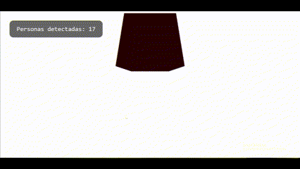

# Monitor Visual 3D con Three.js y Python

Este proyecto integra **detección de personas en video** mediante Python y visualización en 3D con **React Three Fiber** (Three.js + React).

## Descripción general

El sistema detecta personas en un video usando **YOLOv8**. El conteo de personas se guarda en un archivo `datos.json`, que luego es leído en tiempo real por una interfaz 3D desarrollada en React + Three.js.

- Detección de personas con Python + OpenCV + Ultralytics YOLO
- Visualización 3D con un cubo reactivo (cambia color y tamaño)
- Comunicación entre Python y React vía JSON local
- Navegación 3D con OrbitControls

## Vista previa



## Estructura del proyecto

```
raiz-del-proyecto/
├── python/
│   └── detectar_personas_video.py
│   └── datos.json
├── threejs/
│   ├── public/
│   │   └── index.html
│   ├── src/
│   │   ├── App.js
│   │   ├── BoxReactivo.jsx
│   │   ├── Overlay.jsx
│   │   └── ...
│   └── package.json
├── monitor.gif
└── README.md
```

## Instrucciones de uso

### 1. Python (detección)

```bash
cd python
python detectar_personas_video.py
```

Esto generará y actualizará continuamente el archivo `datos.json`.

### 2. Three.js + React

```bash
cd threejs
npm install
npm start
```

Esto abrirá la interfaz 3D que lee el archivo `datos.json` y actualiza la visualización.

---

## Tecnologías usadas

- [Ultralytics YOLOv8](https://github.com/ultralytics/ultralytics)
- [OpenCV](https://opencv.org/)
- [React Three Fiber](https://docs.pmnd.rs/react-three-fiber/)
- [React](https://reactjs.org/)
- [Three.js](https://threejs.org/)

---

## Créditos

Taller realizado como parte del curso de Computación Visual.

