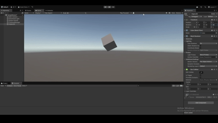
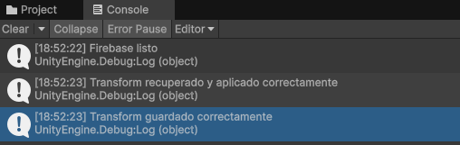
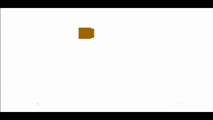
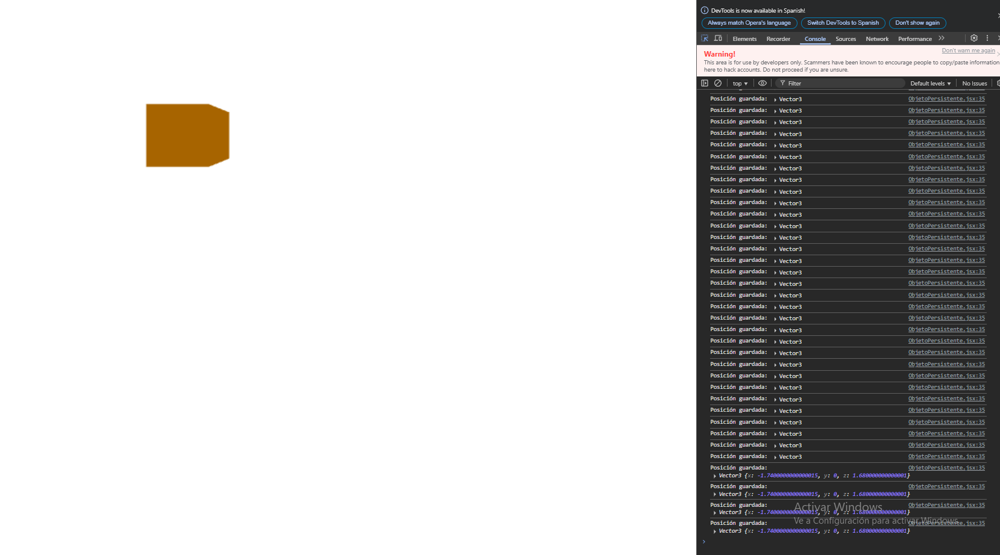
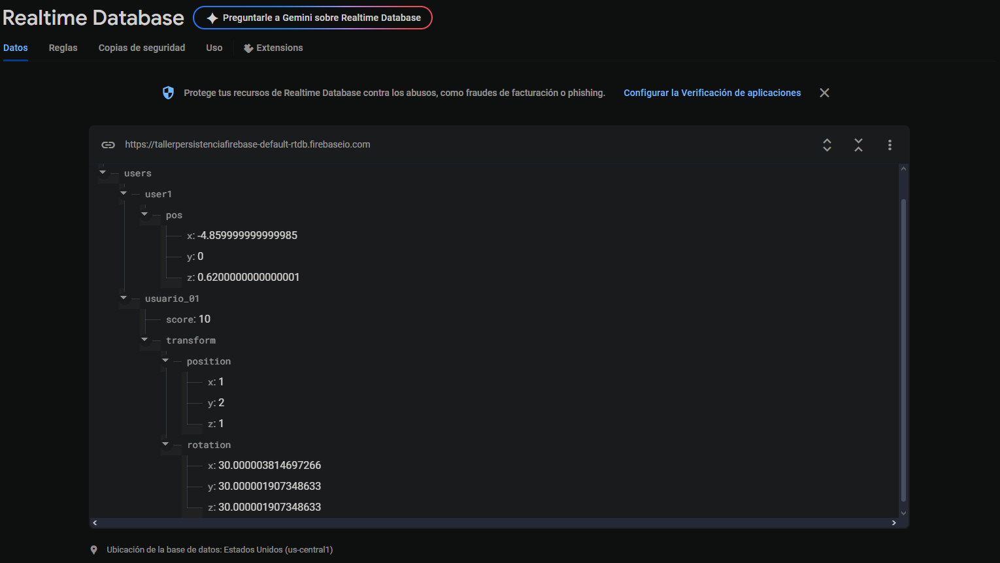

# 💾 Taller - Guardado y Persistencia de Datos con Firebase en Unity y Three.js

Este proyecto implementa un sistema de persistencia de datos en la nube usando **Firebase Realtime Database**. La persistencia fue desarrollada en dos entornos distintos: **Unity** y **Three.js (React)**.

---

## 🎯 Objetivo

Guardar y recuperar información como la **posición** y **rotación** de un objeto 3D en una base de datos remota, permitiendo mantener el estado entre sesiones.

---

## 📂 Estructura del Proyecto

```
unity/                  → Proyecto de Unity con integración Firebase
threejs/                → Proyecto React + Three.js con Firebase
gifs_screenshots/       → Capturas de pantalla y GIFs demostrativos
README.md               → Este documento
```

---

## 🔹 Unity + Firebase

- Se integró Firebase en Unity usando el SDK oficial.
- Se guardó la posición y rotación del cubo en la base de datos.
- Al iniciar la escena, el cubo recupera su posición y rotación desde Firebase.

### Código Clave:
`Assets/Scripts/FirebaseManager.cs`

### GIF de Demostración:


### Consola de Unity Mostrando Guardado Correcto:


---

## 🔹 Three.js + Firebase (React)

- Proyecto realizado en React con Three.js.
- La posición del cubo se guarda automáticamente en Firebase cada 3 segundos.
- Al recargar la app, el cubo recupera su última posición.
- Permite mover el cubo con las flechas del teclado.

### Código Clave:
`src/components/ObjetoPersistente.jsx`

### GIF de Demostración:


### Consola del Navegador Mostrando Guardado Correcto:


---

## 🔹 Base de Datos Firebase (Nodos Guardados)

Estos son los datos almacenados en Firebase, donde se ve la estructura con las posiciones y rotaciones guardadas por Unity y Three.js:



---

## 🧩 Flujo de Persistencia (Ambos Entornos)
1. Al iniciar la app, se consulta Firebase para recuperar la última posición (y rotación en Unity).
2. El objeto se ubica en la posición recuperada.
3. Al mover el objeto:
   - Unity: guarda datos al iniciar.
   - Three.js: guarda automáticamente cada 3 segundos.
4. Firebase almacena la información como JSON.

---

## 🔸 Estructura JSON de Firebase

**Unity (posición y rotación):**
```json
{
  "position": { "x": 0, "y": 1, "z": 0 },
  "rotation": { "x": 30, "y": 30, "z": 30 }
}
```

**Three.js (solo posición):**
```json
{
  "pos": { "x": 2, "y": 1, "z": -1 }
}
```

---

## ✅ Conclusión

Este taller permitió comprender la importancia de la persistencia de datos en la nube y cómo implementarla en distintas plataformas interactivas. Con Firebase, los usuarios pueden mantener su progreso entre sesiones y dispositivos.

---
