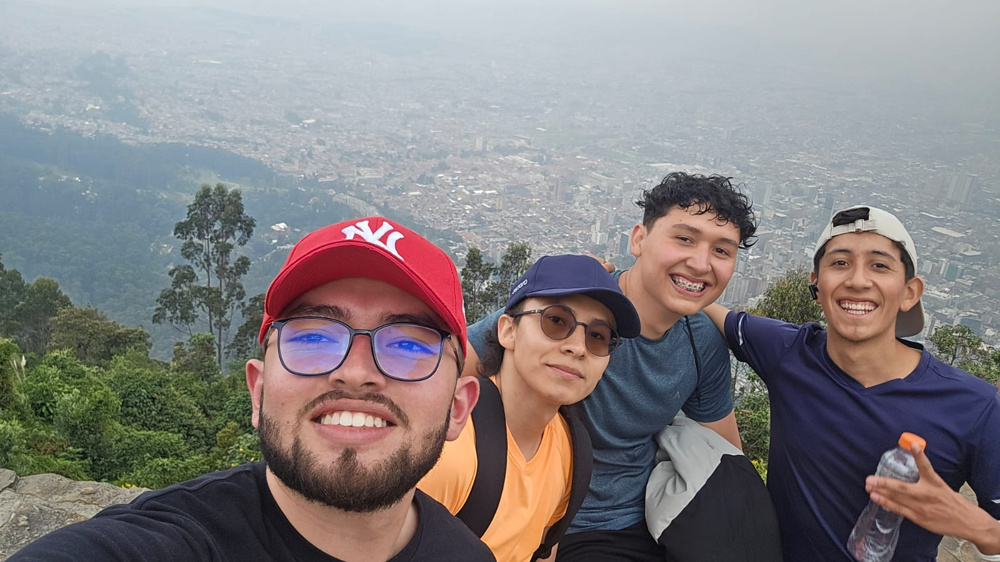
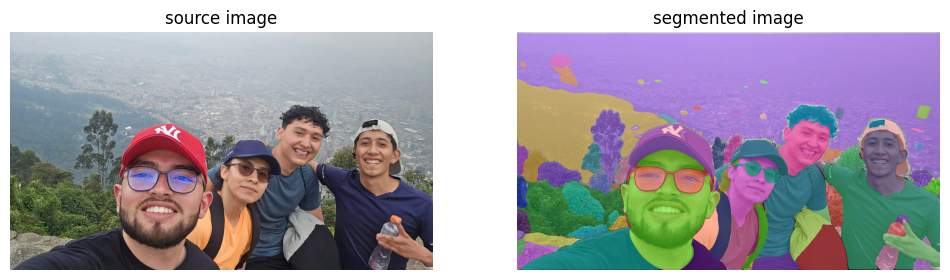

# 🧪 Segmentación Semántica Multimodal: Qué hay en la imagen

## 📅 Fecha
`2025-05-05`

---

## 🎯 Descripción del taller - Modelo usado

Aplicación semántica para identificar y extraer regiones específicas dentro de una imagen, como personas y árboles. Se utilizó el modelo avanzado SAM (Segment Anything Model).

---

## 🧠 Conceptos Aprendidos

- [x] Segmentación Semántica
- [x] Modelo SAM
- [x] Bibliotecas como OpenCV, PIL, Pytorch y Supervision
- [x] Preprocesamiento de imágenes
- [x] Uso de GPU para aceleración


## 📁 Estructura del Proyecto

```
2025-05-05_taller_segmentación_semántica_sam_deeplab/
├── colab_notebook
├── imagenes_entrada
├── imagenes_salida
├── README.md
```

### 🔹 Etapas realizadas
1. Acceso GPU
2. Cargar Modelo y dependencias
3. Preparar entorno y cargar archivos necesarios
4. Cargar el modelo y preparar la imagen para segmentación
5. Visualización de las máscaras segmentadas.

---

## 📊 Imagen original


## 📊 Imagen salida


---

## 🧩 Prompts Usados

NO aplica

---

## 💬 Reflexión Final

Al comparar diferentes métodos de segmentación, se puede observar que cada uno tiene sus ventajas y limitaciones. Algunos métodos, como segmentación basada en bordes o segmentación por umbral, pueden ser más rápidos pero menos precisos en escenarios complejos, donde los objetos tienen bordes difusos o el fondo es similar al objeto. En cambio, los métodos basados en redes neuronales profundas, como el modelo SAM, tienden a ser más precisos y robustos, pero requieren más potencia computacional, es por esto que se debió acceder a la GPU en colab.

---


## ✅ Checklist de Entrega

- [x] Carpeta `Talleres/2025_05_05_taller_segmentación_semántica_sam_deeplab`
- [x] Código limpio y funcional
- [ ] GIF incluido con nombre descriptivo (no requerido en esta versión)
- [x] Visualizaciones 
- [x] README completo y claro
- [x] Commits en inglés

---
